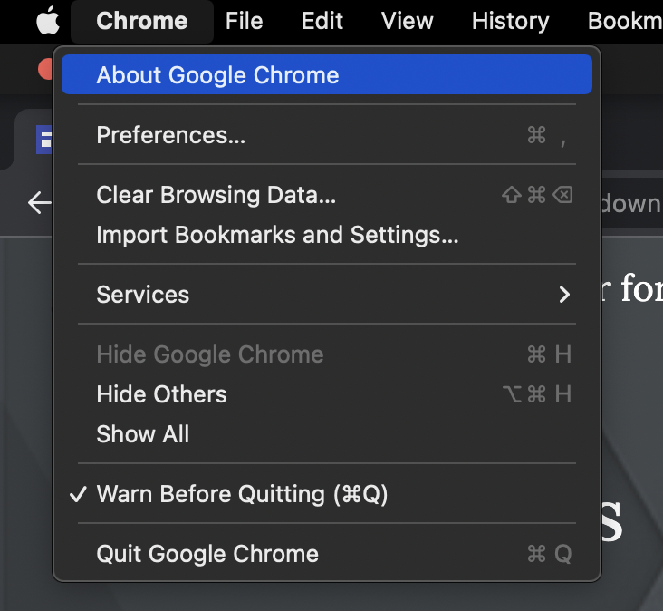
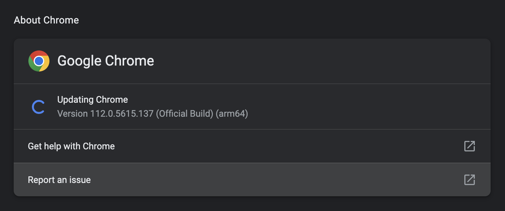
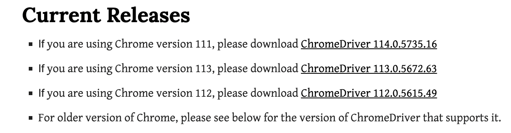
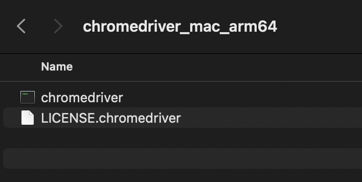
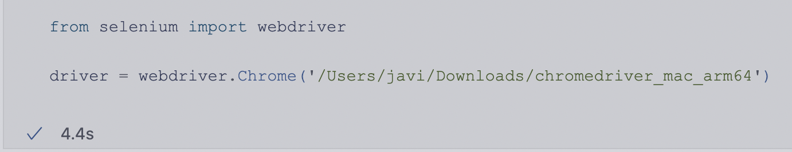

# Selenium Web Scraping

Introducción a los conceptos básicos de Selenium para Web Scraping.

## Tabla de contenidos

- [Introducción](#Introducción)
- [Instalación](#Instalación)
  - [Windows/Mac Intel](#Windows)
  - [Mac M1/ARM64](#ARM64)
- [Tarea](#Tarea)

## Introducción

En este repositorio, se tiene un breve tutorial de como emplear la librería de Selenium (en Python) para poder adentrarse un poco al Web Scraping y sus tareas más básicas.

## Instalación

Para poder correr Selenium en la computadora, ofrecemos dos opciones: una para arquitecuta **AMD64** y otra para **ARM64**. Es decir, una para Windows y otra para Mac M1. A continuación sigue los pasos para poder correr los notebooks. Es importante aclarar que ARM64 no tiene imágenes oficiales disponibles. Por lo cual, para Mac M1 tenemos en vez de un Docker compose un *environment.yml*. 

**Nota:** el Docker Compose de Windows solo ejecuta headless drivers. Pero el environment deja correr los drivers mostrando el navegador.

### Windows

En la carpeta de [Docker-Compose-Selenium](Docker-Compose-Selenium) se encuentra el ambiente de Docker para poder correr los ejercicios de clase con todas las librerías necesarias instaladas. Los pasos son los siguientes

**1. Descarga el repositorio**

Descarga el repositorio en tu computadora.

**2. Asegúrate de tener los puertos correctos**

En el Dockerfile, asegúrate de tener los puertos de tu elección bien seleccionados (en el caso de que los que tenemos por default en el Dockerfile ya estén ocupados en tu computadora).

**3. Corre el Docker**

En tu terminal, estando en la carpeta [Docker-Compose-Selenium](Docker-Compose-Selenium), ejecuta:

<code>docker compose up --build</code>

Asegúrate de tener Docker Desktop abierto.

**4. Abre la aplicación en Chrome**

Entra a Docker Desktop, y en el contenedor de Selenium, selecciona abrir la página con los puertos. **Ojo!** Recuerda abrirlo en **Google Chrome**. 

### ARM64

En esta carpeta, tenemos disponible un [environment.yml](environment.yml). Para tenerlo en tu computadora y poder correr los notebooks:

**1. Descarga el repositorio**

Incluyendo el [environment.yml](environment.yml).

**2. Revisa la versión de tu Google Chrome**

Para eso, abre Google Chrome y abre la pestaña **About Google Chrome**.

Ahora, revisa la versión que tengas instalada.

**3. Descarga el Chromium para tu versión de Chrome**

Entra al siguiente link: https://chromedriver.chromium.org/downloads

Ahora, descarga la versión de Chromium respectiva para tu versión de Chrome. Guarda en algún lugar la versión de Chromium que instalaste.

**4. Encuentra la carpeta que se instaló**

Encuentra la carpeta donde se haya instalado tu Chrome Driver.

Intenta ejecutar *chromedriver*. En caso de que no te deje y tengas Mac (por ser app descargada de internet), ve a la terminal, posiciónate en la carpeta donde esté tu chrome driver y ejecuta la siguiente instrucción:

<code>xattr -d com.apple.quarantine chromedriver </code>

**5. Crea el conda environment**

Luego, en la terminal, posicionado donde se encuentre el [environment.yml](environment.yml), ejecuta la siguiente instrucción:

<code>conda env create -f environment.yml</code>

**6. Activa el environment**

Para activarlo, corre el comando

<code>conda activate selenium</code>
  
O bien, selecciónalo en tu IDE de preferencia (en VS Code en la pestaña de los Kernels).

**7. Modificar ruta de Chrome Driver**

Por último, pon la ruta a la carpeta donde se encuentra tu Chrome Driver cuando inicialices el driver.

## Tarea
  
Para la tarea, creamos un **GitHub Classroom**. Sigue las indicaciones para descargar la tarea.
  
 
